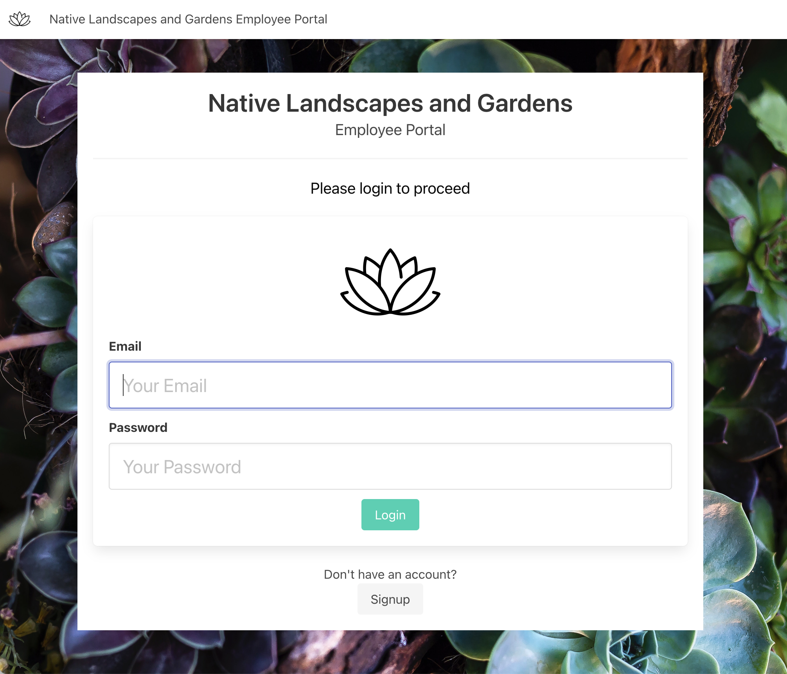
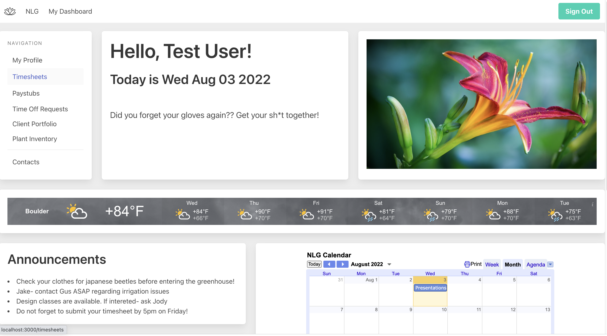
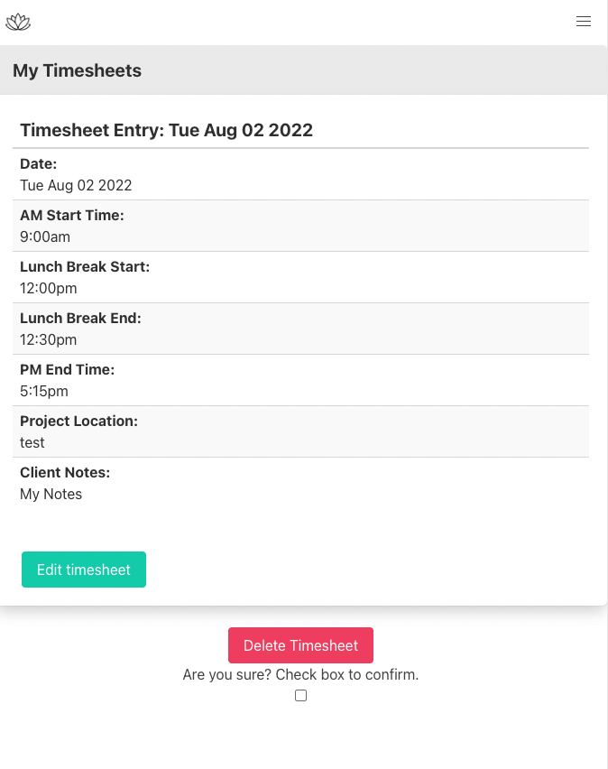

# Native Landscapes and Gardens Employee Portal

An example of a web application that allows landscaping employees of (fake company) Native Landscapes and Gardens to track their billable hours while on location, complete and submit timesheets, access pay data and have easy access to emergency resources and important relevant information.  

# User Stories

- As a user, I should be able to sign up for an account and login to my employee portal from the home page of the website

- From the employee dashboard, a user should have immediate access to current weather and air quality conditions, and be able to click on links that will direct them to resources such as plant information and local emergency services

- From the employee dashboard, a user should be able to access the company calendar with crew schedule and events, important announcements, and a weather widget with local daily forcast

- As a user, I should be able to create, read, update, and delete both my profile information and timesheets.

- As a user, I should be able to destroy my account information as well as any timesheets that I have created.

# Technologies Used

- HTML5
- CSS3
- Bulma
- Mongoose
- MongoDB
- Express/Express-ejs
- Bcrypt
- Sessions

# Screenshots

# Getting Started

[Click here](https://polar-shelf-77084.herokuapp.com/homepage) to see the deployed app!

# Future Enhancements

- User will be able to create, read, update, and delete time-off request forms

- Client Portfolio will be created to track all important client information

- Plant database will be created both with an inventory of what is in the company greenhouse as well as the use of a plant API that allows you to look up plant data plus care and irrigation needs

- Company directory will be added in the "contacts" section of the employee dashboard

- User will be able to filter timesheets by week and month

